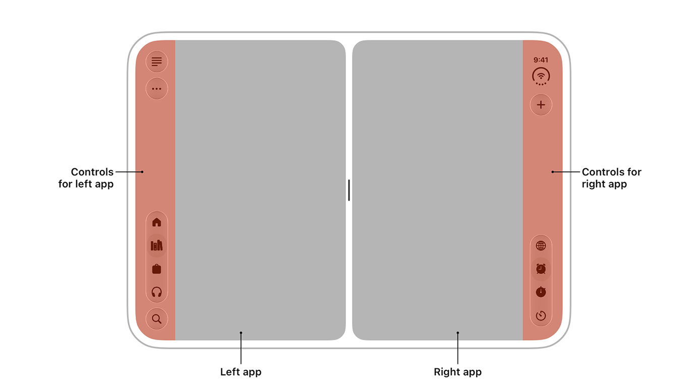

<p align="center">
  
</p>

# iPhone Duo skill

A reusable agent skill for adapting an existing app to iPhone Duo. It directs your coding agent to understand the app's architecture and user flows, implement the required changes, and report evidence from builds and device tests.

The skill includes guidance for SwiftUI, UIKit, React Native, Expo, Flutter, and iOS web wrappers. Framework coverage means the agent has a migration workflow; it does not imply every framework already exposes Apple's new APIs.

## Install in your project

From your app's repository:

```sh
npx skills add mahdi-salmanzade/iphone-duo-skill --skill iphone-duo
```

Choose your coding agent when prompted. To select one directly:

```sh
# Codex
npx skills add mahdi-salmanzade/iphone-duo-skill --skill iphone-duo --agent codex

# Claude Code
npx skills add mahdi-salmanzade/iphone-duo-skill --skill iphone-duo --agent claude-code

# Cursor
npx skills add mahdi-salmanzade/iphone-duo-skill --skill iphone-duo --agent cursor
```

Installation is project-scoped by default. Add `--global` for a personal installation. The [Skills CLI](https://github.com/vercel-labs/skills) documents supported agents and installation options.

For manual installation, copy the complete [skills/iphone-duo](skills/iphone-duo) folder into your agent's skill directory. Keep `SKILL.md`, `references/`, and `agents/` together. For Codex, the project destination is `.agents/skills/iphone-duo/`; for Claude Code, it is `.claude/skills/iphone-duo/`.

## Use it

In Codex:

```text
Use $iphone-duo to understand this app and make it work on iPhone Duo.
Implement the necessary changes, preserve existing behavior, and verify
the important flows. Report any checks the available tools cannot run.
```

In another agent, select the `iphone-duo` skill or explicitly ask it to follow the installed `SKILL.md`. You can also request a narrower task:

```text
Use the iphone-duo skill to audit this app without changing code.
```

```text
Use the iphone-duo skill to fix the editor losing its draft when the
available window size changes. Keep the existing navigation design.
```

## What it does

1. Maps entry points, screens, navigation, state ownership, native integrations, and tests using source evidence.
2. Checks Apple's current guidance against the installed SDK and framework versions.
3. Fixes app-specific failures, including state loss, unreachable actions, and layout constraints.
4. Tests the affected flows and distinguishes simulator, hardware, and other-target evidence.

It uses your agent's existing code, terminal, browser, and testing tools. There is no bundled service, executable migration script, required MCP server, or API key.

## Tooling status and limits

Version **1.2.0** refreshes the Apple and framework references as of **September 30, 2026**. Apple now publishes the written preparation guide, API references, Group Lab recap, and Q&A answers. Xcode 27.1 beta includes the Duo SDK and simulator; Apple's newer Xcode 27.2 beta 2 still directs developers to 27.1 beta for Duo support. The skill checks the selected toolchain and records beta limitations before a migration. [Apple's developer hub](https://developer.apple.com/iphone-duo/), [Xcode 27.2 release notes](https://developer.apple.com/documentation/xcode-release-notes/xcode-27_2-release-notes)

Expo now offers the explicit `macos-tahoe-26.6-xcode-27.1` EAS image with Xcode 27.1 beta. The framework reference covers its build requirements, SDK 57 scene-lifecycle migration, SDK 58 beta changes, and experimental Safari fold APIs. It also corrects sheet/bar behavior, camera format limits, and size-class guidance, and records conflicts in Apple's orientation and layout documentation. Recheck these dated findings and the installed SDK before applying them. [Expo build infrastructure](https://docs.expo.dev/build-reference/infrastructure/)

A skill guides the agent; it cannot guarantee complete understanding of an app or compatibility without running the relevant tests. If the required SDK, simulator, hardware, or app access is missing, the agent should complete the work it can verify and identify the remaining checks.

## Contents

- [Skill instructions](skills/iphone-duo/SKILL.md)
- [App discovery](skills/iphone-duo/references/app-discovery.md)
- [Apple sources and platform behavior](skills/iphone-duo/references/apple-platform.md)
- [Framework-specific implementation](skills/iphone-duo/references/frameworks.md)
- [Verification matrix](skills/iphone-duo/references/validation.md)

## License

MIT. See [LICENSE](LICENSE). This is an independent project, unaffiliated with Apple. External documentation remains subject to its own terms.
